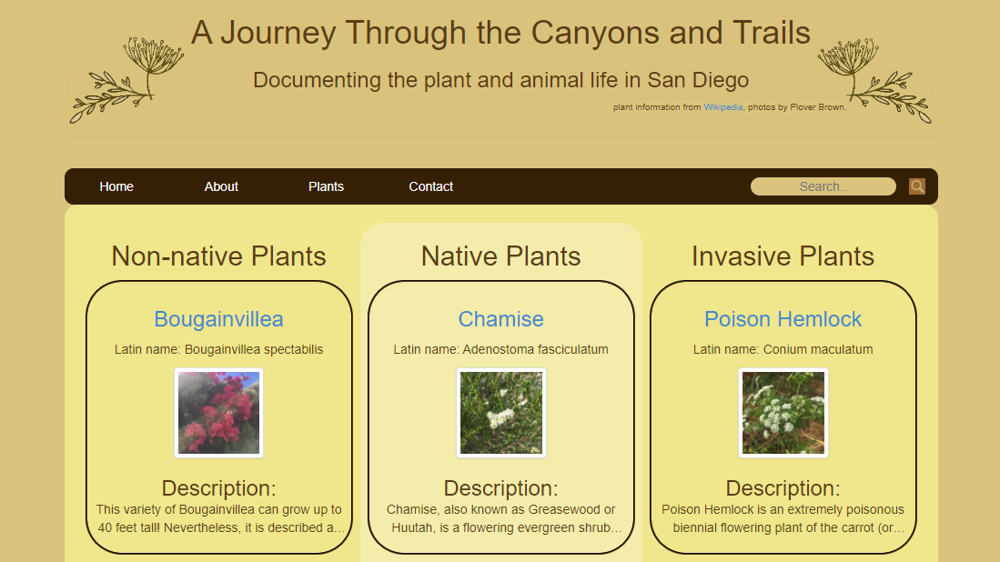

# San Diego Nature Journal

sandiegonaturejournal.pythonanywhere.com

Table Of Contents:

- [Section 1: Introduction](#introduction)
- [Section 2: Installation](#installation)
- [Section 3: Usage](#usage)
- [Section 4: License](#license)
- [Section 5: Credits](#credits)
- [Section 6: Contributing](#contributing)

## Introduction:

This project is a personal journal of San Diego plants. It uses Django with templates to render html for each plant added via the Django admin portal. The site is deployed on pythonanywhere.com, with photos stored on AWS.

## Installation:

This site can be accessed on any internet browser. A future goal is the inclusion of a downloadable plant identification guide.

## Usage:

You can use the code of this project for anything within the limitations of the GNU license. Please access the code by downloading or forking from the GitHub repository.

## License:

GNU General Public License v3.0

## Credits:

- [Trey Hunner](https://treyhunner.com/)
- [Michael Nekrasov](https://michaelnekrasov.com/)

## Contributing:

feel free to contact me if you want to participate!

## Questions: 

You can contact me with questions via:
- [Email](rellwoos@gmail.com)
- [GitHub](https://www.github.com/rebgrasshopper)
- [LinkedIn](https://www.linkedin.com/in/plover-brown-37b6981a5)
